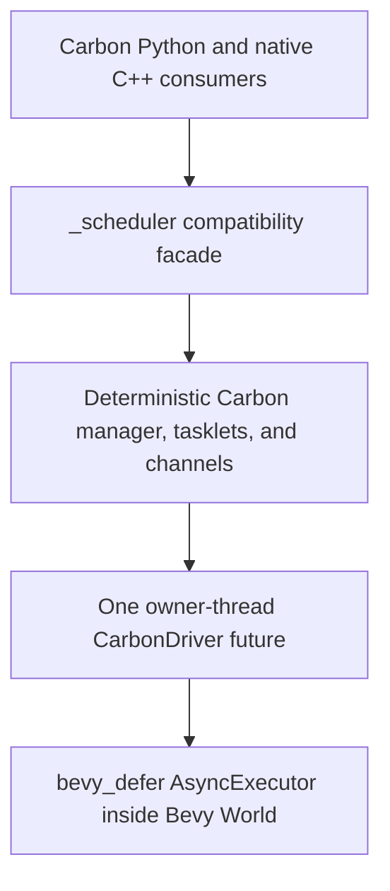

# Carbon Scheduler Compatibility Layer on Bevy Defer — Roadmap v3

- Status: planning only; implementation is not authorized by this document
- Repository: `QuasarRay/carbon-scheduler-lab`
- Branch: `main`
- Planning baseline: `e736c2b8d20e8f6ff5409aa2f2b3f81781e8e58e`
- Allowed implementation tree: `bevy_defer/` only
- Immediate deliverable: this roadmap only

## 1. Outcome

Build an opt-in, drop-in Carbon Scheduler compatibility package **on top of the existing Bevy Defer crate**. The package must let the Carbon Python package and native C++ consumers use Bevy Defer as their host runtime while preserving Carbon Scheduler's public Python API, native capsule ABI, Greenlet behavior, deterministic tasklet ordering, channel rendezvous rules, callbacks, metrics, lifetime rules, and thread affinity.

The selected implementation shape is one additive workspace package:

`bevy_defer/carbon_compat`

That package will:

1. depend directly on the root `bevy_defer` package;
2. expose a `CarbonCompatPlugin`/host adapter for Bevy applications;
3. build an isolated `_scheduler` Python extension for Carbon compatibility tests and packaging;
4. expose `scheduler._C_API` with the unchanged `SchedulerCAPI` C++ layout;
5. retain Greenlet as the stackful continuation mechanism;
6. preserve Carbon ordering in a deterministic compatibility queue; and
7. execute each Carbon scheduling segment from a driver polled by Bevy Defer's owner-thread `AsyncExecutor`.

This is not the v2 `carbon_core` design. There will be no Bevy-free scheduler crate that bypasses the root package. There will also be no attempt to represent each Carbon tasklet as an independently scheduled Rust Future: Bevy Defer owns the host and polling context, while the compatibility layer owns the ordering rules that Carbon exposes.

## 2. Non-negotiable constraints

### 2.1 Path scope

All future repository changes must be under `bevy_defer/`.

The following trees are read-only contract inputs:

- `src/`
- `include/`
- `python/`
- `tests/`
- root `CMakeLists.txt` and CMake support
- root `migration-roadmap/`
- `.agents/`
- `.codex/`
- vendor trees outside `bevy_defer/`

Reading, compiling, importing, and running files from those locations is allowed. Editing, copying changes back, generating caches there, or formatting them is not.

Because the requested roadmap must also live within the permitted tree, v3 is located at `bevy_defer/migration-roadmap/v3.md`, not beside the historical root roadmaps.

### 2.2 Add-only rule

Relative to the pinned planning baseline:

- no existing line may be deleted or replaced;
- no file or directory may be removed, renamed, or moved;
- existing files may receive additive lines only;
- new files may be added only under `bevy_defer/`; and
- generated artifacts must remain in an ignored build directory under `bevy_defer/` or in a temporary directory.

This is a baseline-relative rule. A new file may be revised during its implementation branch, but the final diff against the baseline must contain no deleted lines.

Every future change must pass all of these scope checks:

```text
git diff --diff-filter=D --name-only <baseline>...HEAD       # empty
git diff --name-only <baseline>...HEAD                       # every path starts bevy_defer/
git diff --numstat <baseline>...HEAD                         # deletion count is zero on every row
git diff --check <baseline>...HEAD                            # clean
git status --short                                           # no generated files outside bevy_defer/
```

If a required change cannot be made additively inside `bevy_defer/`, stop and request a constraint decision. Do not work around the restriction with symlinks, generated overwrites, submodule rewrites, symbol interposition, or runtime patching of the legacy extension.

### 2.3 Minimum-change rule

The initial change budget is:

| Existing file | Permitted initial addition |
|---|---|
| `bevy_defer/Cargo.toml` | Add `carbon_compat` as one workspace member |

Everything else in the first experiment should be a new file below `bevy_defer/carbon_compat/`.

Do not add a root `bevy_defer` module, split the adapter into several crates, patch async-executor, change default features, or add a second build system until a failing vertical-slice test demonstrates the need.

The read-only legacy facade cannot be incrementally edited to forward operations into Rust. Under the path restriction, the portable minimum-touch solution is therefore one self-contained replacement artifact inside `bevy_defer/` that consumes the old header and tests as read-only inputs. Reusing the legacy scheduler as the authoritative backend would reduce initial work but would not achieve the stated Bevy Defer integration goal.

### 2.4 Test immutability

The original Carbon Scheduler Python and native C++ test sources must run unchanged. Do not:

- edit expected values;
- add skips or expected failures;
- filter out a failing historical test at the final gate;
- copy tests and claim the copy is authoritative;
- normalize a real ordering or state mismatch; or
- replace the unchanged suite with new adapter-only tests.

New focused tests are allowed only under `bevy_defer/`. They supplement the original suites.

### 2.5 No implementation in this phase

Creating this file is the entire authorized change. No manifest, Rust, C++, Python, test, CI, or build change begins until separately requested.

## 3. Ground truth from the repository

### 3.1 What Bevy Defer currently is

The root `bevy_defer` package is not a generic Bevy-free executor facade:

- `bevy_defer/Cargo.toml` has an unconditional Bevy dependency;
- `CoreAsyncPlugin` initializes an `AsyncExecutor`, query queues, query caches, reactors, inspectors, signals, and schedules in a Bevy `App`;
- `AsyncExecutor` wraps an `Rc<async_executor::LocalExecutor<'static>>` and is therefore owner-thread/non-`Send` state;
- `run_async_executor(World)` installs scoped `World`, `QueryQueue`, `Reactors`, `AssetServer`, and spawner context, then repeatedly calls `try_tick()`; and
- ordinary Bevy Defer Futures rely on that scoped context for world access, waits, timers, reactors, and spawning.

V3 must reuse that execution path. Merely putting a Carbon crate in the same checkout does not satisfy the project goal.

### 3.2 What Carbon Scheduler currently is

The Carbon runtime is a synchronous, stackful, per-Python-thread scheduler built around Greenlet. Its public behavior cannot be obtained by handing tasklets independently to async-executor.

Important baseline properties include:

- a running tasklet remains linked in the runnable chain until control returns to `ScheduleManager::Run()`;
- `tasklet.switch()` routes through manager `Run(this)` and parent/yield behavior rather than being a raw isolated Greenlet switch;
- a callable-only bind is bound but not alive and has no Greenlet;
- bind with arguments is alive and paused but not runnable;
- setup is alive and runnable;
- a trapped run of a paused tasklet can leave `paused` and `scheduled` true together;
- main can enter a channel sender or receiver wait queue while another tasklet progresses;
- scheduler callbacks execute before `m_currentTasklet` is committed;
- the target's `times_switched_to` increments before that callback;
- callback storage and timeout counters are process-global in the existing implementation;
- channel rendezvous commits the released tasklet to its owner manager synchronously; and
- Greenlet switching must occur on the owning Python/OS thread.

The compatibility representation must therefore use orthogonal state axes. A single clean `Unbound / Ready / Running / Blocked / Paused / Dead` enum is not a lossless baseline model.

### 3.3 Corrections adopted from report-v2

V3 incorporates every material report-v2 finding:

1. Production-grade oracle work is not a prerequisite to an experimental vertical slice.
2. The compatibility implementation depends on and runs through root Bevy Defer; it does not bypass it with a Bevy-free core.
3. Selecting the checked-in async-executor fork is not mandatory unless an experiment proves a required role for it.
4. Receive ordering records `transfer_in_progress = true` before the channel callback.
5. Bind/setup/run/switch are migrated with their callable, parent, callback, and exception dependencies, not as an artificial independent phase.
6. Channels move with blocked-tasklet kill/throw/clear/close behavior, not before that control bridge exists.
7. The known-defect seed list includes the additional callback, exception-handler, GC, and callable-wrapper ownership findings.
8. The contract model includes allowed outcome sets and partial-order equivalence for legitimate unspecified ordering.
9. Carbon I/O is a mandatory experimental integration gate.
10. Experimental and production Definitions of Done are separate.

## 4. Target architecture



### 4.1 One additive compatibility package

`bevy_defer/carbon_compat` is both:

- a Rust library that exports the Bevy integration surface; and
- a Python/native extension build that exports the Carbon surface.

It depends on `bevy_defer = { path = ".." }`. Neither the Python facade nor the native capsule links directly to an independent Carbon kernel. The package's Carbon policy modules are private implementation details behind a Bevy Defer-hosted driver.

Keep this as one package for the experiment. Splitting Python FFI, native ABI, state policy, or Bevy hosting into separate crates is allowed only after measured build, ownership, or reuse pressure justifies the extra boundaries.

### 4.2 Two scheduling domains with a strict boundary

| Domain | Owns | Must not own |
|---|---|---|
| Bevy Defer host | `World` context, owner-thread executor polling, wake delivery, plugin/system placement, optional auxiliary Futures | Carbon runnable order, channel preference, parent selection, tasklet kill/throw policy |
| Carbon compatibility | manager registry, deterministic runnable chain, tasklet axes, Greenlet continuation calls, channels, callbacks, budgets, public counters | arbitrary Bevy worker execution, Bevy ECS borrowing across Python/Greenlet calls |

The boundary is intentional. Using Bevy Defer as the host does not authorize async-executor's queue, cancellation, detach, or wake order to become Carbon semantics.

One `CarbonDriver` Future represents a manager's Carbon scheduling domain. A driver poll may execute the complete synchronous segment requested by `run`, `schedule`, `switch`, or a rendezvous. It must not `.await` between scheduler-visible mutations within that segment. Auxiliary Futures can run before or after a segment, but cannot interleave inside a Greenlet transition or reorder Carbon's queue.

### 4.3 Standalone Carbon host

The original Carbon tests do not create a Bevy `App`. The compatibility package therefore supplies an internal headless host for each Python thread that first creates a schedule manager.

The headless host:

1. owns a minimal Bevy `App`/`World` on that same thread;
2. installs the existing Bevy Defer core runtime and the compatibility plugin;
3. registers one manager driver with the existing `AsyncExecutor` resource;
4. contains no unrelated Future during deterministic test runs; and
5. pumps the executor synchronously until the requested Carbon API boundary completes.

This is not a separate non-Bevy mode. Even the headless compatibility path executes through the Bevy Defer runtime. It simply provides the smallest Bevy host needed by Carbon applications that do not already own one.

### 4.4 Embedded Bevy host

An application that already owns a Bevy `App` adds the compatibility plugin. The plugin must:

- require or install `CoreAsyncPlugin` without changing ordinary Bevy Defer defaults;
- register non-`Send` compatibility state;
- establish explicit ordering relative to `run_async_executor`;
- ensure the manager and its Greenlets were created on the same thread that polls them;
- expose a wake path for committed cross-thread work; and
- leave explicit Carbon `scheduler.run()` semantics available.

The application must register this owner host before the thread creates its first Carbon manager. Once a manager has selected either the embedded host or its internal headless host, it cannot be rebound to a different `App`, executor, or thread.

No Bevy worker may poll an arbitrary manager. A foreign worker may enqueue an external request or wake the owner, but only the exact owner thread may invoke Python or Greenlet control transfer.

### 4.5 Reentrancy protocol

The first feasibility spike must prove this protocol before broader implementation:

1. An outer call from main submits an operation request and pumps the Bevy Defer driver.
2. The driver holds no borrow of reentrant compatibility state and no lock across a Python callback or Greenlet switch.
3. Python code running inside the switched tasklet may re-enter `_scheduler`.
4. A nested `schedule`, channel block, or parent yield switches through the stored continuation boundary; it does **not** recursively call `App::update()` or `LocalExecutor::try_tick()`.
5. Control returns to the suspended driver poll, which commits the next state and then returns or continues the requested segment.

All mutable compatibility state that survives a switch must be in stable heap storage. No derived `World`/resource/entity borrow, compatibility-state borrow, `RefCell` borrow, Rust guard, Python borrowed reference, or temporary FFI view may remain live across `PyGreenlet_Switch`.

`run_async_executor` necessarily keeps Bevy Defer's scoped `WORLD` host binding installed while it polls the driver. The feasibility proof must distinguish that existing host binding from a derived ECS borrow: the binding may remain installed, but the adapter must finish every actual world/resource/entity access before switching, and reentrant access may occur only through Bevy Defer's existing scoped access protocol after compatibility borrows have been released.

If this protocol cannot be demonstrated safely, stop. Do not silently fall back to a standalone scheduler that merely happens to live in `bevy_defer/`.

### 4.6 Cross-thread commitment

Cross-thread channel use remains serialized by the GIL in the v3 compatibility target. Free-threaded Python is out of scope.

When a rendezvous releases a tasklet owned by another manager:

1. the channel match, packet transfer, waiter removal, balance update, and logical runnable insertion are committed synchronously while the operation holds the GIL;
2. `getruncount`, tasklet properties, and callbacks must observe that committed state immediately;
3. a wake notification may then be queued or coalesced for the owner host; and
4. actual Greenlet execution waits for the owner thread.

A command that postpones logical insertion until the next Bevy pump is incompatible. A command/wake queue is acceptable only after the owner manager's public scheduling state has been committed.

Split each manager record into (a) GIL-serialized logical Carbon state and (b) owner-only continuation/Bevy host state. A foreign Python thread may update only the logical queue, packet, and wake fields while it holds the GIL. It must never touch the owner's `Rc<LocalExecutor>`, Bevy `App`/`World`, Greenlet continuation, or other non-`Send` host state.

Do not introduce a general channel mutex for the initial compatibility path. If a host-only wake structure needs synchronization, keep that synchronization outside Python callbacks, decrefs, Greenlet calls, and Carbon state transitions.

### 4.7 async-executor policy

The root Bevy Defer manifest currently names a crates.io async-executor dependency, while a separate async-executor source tree is checked in under `bevy_defer/async-executor`.

V3 does not require selecting or modifying that fork for the experiment. The compatibility package first uses the executor selected by the root Bevy Defer package and records it with `cargo metadata`.

Only patch to the local fork if a focused Bevy-host test proves that the public root runtime cannot provide a required capability. If that happens:

- add an explicit path or `[patch.crates-io]` override; workspace membership alone is insufficient;
- prove the selected package ID and manifest path with `cargo metadata` and `cargo tree`;
- add a focused regression for the required executor behavior;
- run the fork's unchanged tests and all root Bevy Defer tests; and
- keep Carbon ordering outside async-executor.

## 5. Public compatibility surfaces

### 5.1 Python extension and package

The opt-in artifact is named `_scheduler` in an isolated staging directory. The unchanged `python/scheduler/__init__.py` must import it without a compatibility fork of the Python package.

Preserve:

- module-level functions, argument parsing, return values, exceptions, and doc-visible names;
- `tasklet`, `channel`, and `schedule_manager` exported types;
- `TaskletExit` identity and inheritance;
- weak references, subclassing, callable tasklet setup, iterator behavior, and invalid-subclass errors;
- every tasklet method and property exported by the baseline, including members not exercised by the original suite;
- every channel method and property exported by the baseline, including members not exercised by the original suite;
- `QueueChannel` and `block_trap` behavior supplied by the unchanged Python wrapper;
- process-global callbacks and metrics where the baseline exposes them; and
- release/debug/internal/trinity naming only when the corresponding platform build is promoted beyond the initial release-flavor experiment.

Opt-in selection is performed by artifact/search-path selection before Python import. Do not add a runtime backend switch to the read-only Python package, and do not switch implementations after a manager, tasklet, or channel exists.

### 5.2 Native C++ capsule API

The existing header is C++-only. Preserve the native C++ consumer contract, not a newly invented C ABI.

Freeze and test:

- capsule import name `scheduler._C_API`;
- the pointer stored in the capsule;
- `SchedulerCAPI` size, alignment, declaration order, offsets, function signatures, and calling conventions;
- `PyTaskletType` and `PyChannelType` identities;
- every function's Python reference ownership and error convention; and
- `TaskletExit` as `PyObject **`, including `*TaskletExit` identity.

Do not compare bytes of the opaque `PyCapsule` object.

For the smallest reliable ABI bridge, a new C++ shim under `bevy_defer/carbon_compat/native/` should include the unchanged root `include/Scheduler.h`, instantiate the table using that header, and forward through panic-contained `extern "C"` Rust entrypoints. That avoids duplicating the C++ layout by hand in Rust while leaving the original header untouched.

The initial native gate recompiles the unchanged original consumer tests. Production ABI promotion additionally needs frozen baseline layout constants and a precompiled legacy consumer; recompiling both sides from the current header is not sufficient binary-compatibility proof.

### 5.3 Build/test overlay without root changes

Because root CMake files are read-only, the compatibility package owns an additive test harness below `bevy_defer/carbon_compat/` that:

- builds the Rust/C++ extension into a private staging directory;
- points `PYTHONPATH` at that directory and the unchanged root `python/` directory;
- compiles the original native C++ test sources directly from their read-only paths;
- supplies an imported `Scheduler` target and the unchanged include directory to those tests;
- stages an experimental Scheduler package description for Carbon I/O; and
- writes all CMake, Cargo, Python bytecode, and test outputs under `bevy_defer/target/` or a temporary directory.

Set `PYTHONDONTWRITEBYTECODE=1` whenever Python executes source outside `bevy_defer/`.

## 6. Compatibility state and transition model

### 6.1 Orthogonal tasklet axes

At minimum, store or derive these axes separately:

- wrapper valid/cleared;
- manager identity and owner thread;
- is main;
- callable bound;
- Greenlet/continuation present;
- alive;
- paused;
- current;
- public scheduled flag;
- runnable-link membership and neighbors;
- blocked flag;
- channel FIFO membership, direction, and neighbors;
- transfer in progress and transfer packet;
- parent;
- first-run;
- reschedule request;
- tagged removal;
- pending kill/control; and
- `times_switched_to`.

Required representable configurations include:

| Configuration | Bound | Greenlet | Alive | Scheduled | Runnable role | Paused | Notes |
|---|---:|---:|---:|---:|---|---:|---|
| Constructed/unbound | no | no | no | no | none | no | Public tasklet object exists |
| Bound dormant | yes | no | no | no | none | no | `bind(callable)` only |
| Bound paused | yes | yes | yes | no | none | yes | `bind(args=...)` |
| Ready | yes | yes | yes | yes | member | no | `setup(...)` or insertion |
| Active linked | yes | yes | yes | yes | member/current | no | Current tasklet remains in queue during execution |
| Trapped paused run | yes | yes | yes | yes | member | yes | Failed switch can leave paused plus scheduled |
| Channel blocked | yes/no | yes | yes | operation-specific | transient member or none | operation-specific | Main or non-main may be in a send/receive FIFO; removal occurs after outer run regains control |
| Main | no | yes | yes | yes | queue sentinel/current | no | May also be channel-blocked while children progress |
| Dead wrapper | implementation-specific | no/dead | no | no | none | no | Python wrapper may remain observable |

The internal implementation may add clean derived enums for local control flow, but those enums must not erase any public combination above.

### 6.2 Runnable-chain laws

The compatibility queue must implement Carbon operations, not generic executor operations:

- insert at back;
- insert to run next;
- front-plus-one reschedule;
- remove linked tasklet;
- select relative to the current/base tasklet;
- snapshot the entry tail for a targeted nested run;
- keep the selected tasklet linked while its Greenlet executes;
- remove it only after control returns;
- then apply terminal cleanup, back reschedule, or front-plus-one reschedule; and
- expose stable `next`, `prev`, cached run count, and calculated run count.

Runnable order and channel FIFO order are exact contracts. async-executor must never choose the next Carbon tasklet.

### 6.3 Coupled tasklet control

Bind, setup, run, switch, callable wrapping, parent selection, and exception delivery form one migration unit.

In particular:

- `bind(callable)` records metadata and callable policy without creating a Greenlet;
- `bind(..., args/kwargs)` creates a Greenlet and marks alive without insertion;
- `setup(args/kwargs)` requires a bound callable, creates the Greenlet, marks alive, and inserts;
- `run()` inserts a detached alive tasklet before manager traversal;
- `switch()` uses manager traversal and parent/yield behavior;
- switch-trap is checked at the operation-specific point, not as a universal preflight rule;
- parent updates and rollback must be part of the same transition; and
- exception, `TaskletExit`, `dont_raise`, context-manager, and exception-handler policy must be available when the associated callable or control path first moves.

Do not move queue decisions first and defer those dependencies to a later phase without an explicit bridge.

### 6.4 Exact schedule callback transition

For a same-thread switch to a different tasklet, preserve this observable order:

1. validate the switch up to the operation-specific trap point;
2. increment the target's `times_switched_to`;
3. increment the time-limited switched counter through the switch hook when applicable;
4. invoke the Python schedule callback with `(previous, next)`;
5. invoke the fast native callback even if the Python callback left an exception pending, matching the classified baseline path;
6. commit current to `next`; and
7. invoke the Greenlet continuation.

During the Python callback, `getcurrent()` still returns `previous`, while `next.times_switched_to` already reflects the increment.

Successful callback results must be released safely; reproducing the legacy result leak is not required. Pending exception timing and continuation through the fast callback are separate observable contracts and must be tested.

### 6.5 Exact channel entry order

`will_block` means that no opposite waiter existed at callback entry. It is not a promise that the operation ultimately blocks. The callback is invoked even when a later trap, closed check, or callback-induced reentrancy makes the operation fail.

#### Send prefix

1. Capture counterpart absence.
2. Invoke the channel callback.
3. Set the current tasklet's transfer-in-progress flag.
4. On the unmatched path, check current validity, block-trap, and closed/closing state in baseline order.
5. If validation permits blocking, acquire the waiter reference, link the sender, mark it blocked, store the packet, and yield; apply the baseline cleanup on failure.
6. On the matched path, pop the oldest receiver, transfer the packet, synchronously commit scheduling, and apply preference.

#### Receive prefix

1. Set the current tasklet's transfer-in-progress flag.
2. Capture counterpart absence and invoke the channel callback.
3. If unmatched, acquire the waiter reference, link it into the receive FIFO, and update balance.
4. Check block-trap and closed state at their baseline points and perform the corresponding rollback.
5. If matched, pop the oldest sender, transfer or restore its exception packet, synchronously commit scheduling, and apply preference.

Send and receive deliberately differ at callback entry. A common helper that always calls the callback before setting the transfer flag is wrong.

### 6.6 Channels and blocked control are one unit

Channel ownership cannot be complete without:

- blocking and unblocking;
- send/receive FIFO links;
- transfer packets and exception packets;
- preference `-1`, `0`, and `1`;
- main-tasklet wait and deadlock behavior;
- kill and throw of blocked tasklets;
- pending kill;
- clear, close, open, and teardown;
- callback reentrancy; and
- cross-thread owner-manager commitment.

Move and test these together. Exactly one component owns unlinking, balance adjustment, packet release, waiter reference release, and runnable commitment on each success, error, kill, close, and teardown path.

### 6.7 Preference entrypoints remain distinct

- Python assignment accepts only `-1`, `0`, or `1`; an in-range integer changes the value and an ordinary out-of-range integer leaves the previous value unchanged.
- The native C++ setter clamps below `-1` to `-1` and above `1` to `1`.
- Python integer-conversion overflow is a known defect boundary and needs a safe, explicitly classified result rather than accidental pending-error success.

Do not implement both entrypoints as one clamping setter.

### 6.8 Run budgets and counters

For experimental compatibility:

- preserve main-only budget checks;
- preserve the first-iteration progress guarantee for time limit zero;
- preserve the baseline's ambient manager run-mode behavior unless a focused nested-run decision approves a divergence;
- preserve the two timeout getter counters as process-global publication, not per-manager fields;
- count the baseline's successful queue-removal/dequeue cycles rather than renaming the value terminal completions; and
- do not increment the switched counter when switch-trap returns before `SetCurrentTasklet`/`OnSwitch`.

A clean nested run-scope stack and per-manager metrics are possible later extensions, not silent parity changes.

### 6.9 Legitimate unspecified order

Add a contract class for operations whose baseline uses `std::unordered_set` iteration, notably global channel unblock and manager teardown across unrelated objects.

For these operations, compare:

- the allowed final-state set;
- exact order within each runnable/FIFO object;
- required happens-before relationships;
- exactly-once cleanup; and
- absence of forbidden outcomes.

Do not require one total cross-object order unless the public API or a trusted test actually specifies it. This is not permission to weaken deterministic runnable or channel FIFO comparisons.

## 7. FFI, ownership, GC, and safety

### 7.1 Boundary rules

- No Rust panic crosses a Python or native boundary.
- No Python C API call occurs without the GIL.
- No Greenlet operation occurs off its owner thread.
- No Python reference is released on an arbitrary Bevy/async worker.
- No lock, reentrant compatibility-state borrow, or derived ECS borrow crosses Python code, a finalizer-capable decref, callback invocation, or Greenlet switch.
- Every raw tasklet/channel/manager handle validates type, liveness, generation, cleared-wrapper state, and owner as applicable.
- A success return has the intended pending-exception state; an error return sets the intended Python exception.
- Unsafe code is concentrated in the Python, Greenlet, capsule, and callback shims.

### 7.2 Greenlet bridge

Use a small C++ bridge under `bevy_defer/carbon_compat/native/` for Greenlet C API operations and any compiler-specific native ABI details. The bridge must expose only the operations the state machine needs:

- import/initialize Greenlet C API;
- current Greenlet;
- create;
- switch;
- set/get parent;
- alive/dead query; and
- deterministic cleanup.

The Rust caller must place all state in stable storage and end all borrows before calling the bridge. Reentrant Python entrypoints recover state through stable handles rather than aliases to the suspended Rust stack.

### 7.3 Python ownership ledger

Before each Python edge is introduced, record its ownership and GC behavior. The minimum ledger covers:

- thread-state dictionary to manager wrapper;
- manager to main tasklet and registered tasklets;
- Python wrapper to Rust handle;
- tasklet to callable, args, kwargs, Greenlet, transfer value/exception, pending exception, exception handler, and context-manager getter;
- runnable queue membership reference;
- channel FIFO membership and transfer packet;
- parent relation;
- global Python schedule/channel callback slots;
- native fast callback slot;
- module to Greenlet state, types, exception, and capsule;
- capsule to static table and `PyObject **TaskletExit`; and
- host wake to manager identity without extending Python lifetime.

Every acquire must name the matching success, replacement, rollback, clear, and deallocation release.

### 7.4 CPython cyclic GC

Tasklet wrappers are GC-tracked. As soon as Rust owns a Python edge, wrapper traversal and clearing must reach it.

The adapter must provide:

- traversal of every direct strong Python edge exactly once, under the GIL, without user code, allocation, mutation, or reference-count changes;
- idempotent clear that detaches all cycle-forming edges and leaves a safe tombstone;
- safe repeated `tp_clear` followed by `tp_dealloc`;
- weakref clearing with baseline-compatible timing; and
- equivalent manager/channel traversal if those wrappers own cycle-forming Python references.

GC support is implemented incrementally with each edge. It is not deferred to a late cleanup phase after scheduler behavior already depends on Rust-owned references.

### 7.5 Known defect seed register

The experiment does not require a complete historical defect census before the first vertical slice. It does require a named decision before implementing any known defect that intersects the active slice.

The initial seed list includes:

| Area | Known baseline issue or candidate | Experiment policy |
|---|---|---|
| Tests | Worker-thread `assertRaises` calls evaluate outside the assertion | Keep historical test; add a reliable adapter-side probe before trusting the result |
| Native tests | Stolen-reference tuple cleanup has suspicious double decref | Keep historical test; add an audited native probe |
| Parsing | `switch_trap` continues after parse failure with an uninitialized delta | Implement deterministic error/no mutation; mark approved safety divergence |
| Callback setter | Previous callback may be decref'd before it is returned | Return an owned live object safely while preserving visible identity |
| Callback ownership | Python and native setter ownership expectations differ | Preserve entrypoint-specific contracts until a deliberate native contract decision |
| Callback invocation | Scheduler and channel callback success results leak | Release results safely; separately preserve callback/error ordering |
| Parent | `SetParent` failure paths can leak acquired parent/main references | Balance all paths; preserve public parent outcome |
| Channel receive | Closed unmatched receive has asymmetric waiter release | Balance ownership; preserve public error, queue, and balance outcome |
| Queue | Run-next duplicate path acquires before already-scheduled check | Characterize reachability; never hide under a generic leak label |
| Tasklet handler | Getter lacks a new reference and destructor retains handler | Implement safe getter/destructor ownership |
| Tasklet GC | Baseline traverse/clear omits several owned edges | Traverse and clear the complete new ownership graph |
| Callable wrapper | Successful enter/handler/exit results and exit args leak | Release all temporary results while preserving call/error order |
| Manager creation | Thread-dictionary failure appears to double release | Fault-inject before production promotion |
| Module state | Greenlet import state has no explicit teardown | Choose documented process retention or balanced teardown |
| Send errors | Transfer flag can remain set after early trap/closed failure | Preserve only if a touched observable contract requires it; otherwise classify the safe divergence |
| Limited run | Nested limited runs can corrupt an outer ambient budget | Preserve for experimental parity or approve a named divergence after characterization |
| Teardown | Tasklet that catches `TaskletExit` can make cleanup nonterminating | Keep out of ordinary process tests; define a bounded production policy separately |

Memory leaks, double releases, dangling references, uninitialized reads, or infinite teardown are never treated as goals merely because legacy source contains them. Observable safe behavior around those defects still needs a classified expectation.

## 8. Evidence strategy

### 8.1 Two milestones, not one oversized gate

V3 separates:

1. **Experimental backend milestone:** learn whether a real Bevy Defer-hosted drop-in backend works, while running all unchanged Scheduler and Carbon I/O tests and making no production-equivalence claim.
2. **Production compatibility milestone:** complete contract classification, differential/property evidence, ABI proof, ownership/sanitizer campaigns, platform coverage, performance budgets, and operational promotion.

The second milestone remains necessary before replacing a production backend. It is not a prerequisite to writing the first useful implementation.

### 8.2 Contract classes

Classify only the behavior touched by the current phase during the experiment. Use these classes:

| Class | Meaning | Comparison |
|---|---|---|
| Exact | Defined deterministic public behavior | Exact result, exception, state, callback, and order |
| Allowed outcomes | Defined operation with unspecified sibling/cross-object order | Allowed set plus partial order/happens-before |
| Safety repair | Named memory-safety/UB fix | Baseline and target each have explicit expectations |
| Host extension | New Bevy integration behavior with compatibility mode unchanged | Extension-specific tests plus off-mode invariance |
| Unsupported | Explicitly outside target, such as free-threaded Python | Deterministic rejection and documentation |

Do not use “legacy defect” as a normalization bucket. A row must state what each backend is expected to do.

### 8.3 Authority and test trust

For deterministic public behavior, use this evidence order:

1. reliable unchanged test that actually observes the result;
2. implementation control flow at the pinned baseline;
3. reliable focused black-box probe;
4. public documentation;
5. comments.

Existing tests are mandatory regression gates, but not unquestioned ownership or threading authorities. Known broken assertions and suspicious reference handling remain visible and receive parallel reliable probes under `bevy_defer/`.

### 8.4 Lean pre-implementation baseline

Before the first code slice, capture only:

- exact toolchain and dependency versions needed to build the two existing projects;
- baseline pass/fail/skip results for root Bevy Defer tests and original Scheduler tests on the available platform;
- public Python member names and native `SchedulerCAPI` fields;
- eight sentinel behaviors: queue order, bind/setup distinctions, active-linked execution, trapped paused run, main send/receive blocking, callback timing, channel entry ordering, and timeout counter scope; and
- the Carbon I/O revision/build recipe used for the downstream gate.

Do not require classification of every historical test, 35 characterization cases, Hypothesis state machines, a precompiled consumer, trace instrumentation, or sanitizer closure before the host feasibility spike.

### 8.5 Tracing after the vertical slice

A full legacy trace adapter cannot be added outside `bevy_defer/` under the path restriction. Begin with test-only event logs in the new backend and black-box observations from the unchanged legacy module.

Any compatibility trace must:

- use numeric/generational IDs, not strong Python references;
- avoid `repr`, equality, hashing, descriptors, or user code;
- hold no object past its baseline lifetime;
- use sequence numbers rather than wall-clock ordering;
- not add a lock order or I/O in the transition path; and
- be fully disabled without changing decisions.

The corrected channel trace must encode send and receive prefixes separately. Legitimately unspecified cross-object cleanup uses a partial-order comparator, not a total trace.

## 9. Phased roadmap

No phase begins until code work is separately authorized.

### Phase 0 — Lean baseline and scope guard

Purpose: establish a reproducible comparison without delaying the experiment behind production certification.

Actions:

1. Pin the lab commit, Rust/C++/Python/Greenlet/Bevy versions, supported initial platform, and downstream Carbon I/O revision.
2. Run the existing Bevy Defer and Carbon Scheduler suites without modifying their sources.
3. Record failures and skips exactly; do not repair tests outside `bevy_defer/`.
4. Create the add-only/path-scope CI guard.
5. Record the Python surface and native table from the unchanged sources.
6. Add focused black-box sentinel probes under `bevy_defer/carbon_compat/tests/` only as needed by the first slice.
7. Create a small touched-contract ledger, not a complete production registry.

Exit:

- baseline results and skips are reproducible;
- every planned write is inside `bevy_defer/`;
- the original test sources remain byte-identical; and
- no broad oracle or defect-audit prerequisite blocks Phase 1.

Rollback: abandon the unmerged additive experiment branch or select the pinned baseline commit. Do not delete lines from a retained branch.

### Phase 1 — Prove the Bevy Defer/Greenlet vertical slice

Purpose: answer the highest-risk architectural question before implementing the API breadth.

Actions:

1. Add `carbon_compat` as one workspace member.
2. Add one package that depends directly on root `bevy_defer`.
3. Create a minimal headless Bevy host using the existing `CoreAsyncPlugin`/`AsyncExecutor` path.
4. Poll one `CarbonDriver` Future through `run_async_executor`.
5. From that poll, call a minimal owner-thread Greenlet bridge, run Python, yield back through a nested scheduler entrypoint, and resume the original driver poll.
6. Prove no derived ECS borrow, reentrant compatibility-state borrow, lock, or temporary Python reference crosses the switch; separately validate the scoped `WORLD` host binding that `run_async_executor` keeps installed.
7. Prove wrong-thread polling is rejected before Python/Greenlet mutation.
8. Prove ordinary Bevy Defer tests and behavior remain unchanged.
9. Record `cargo metadata`; do not patch async-executor unless this spike demonstrates a missing required capability.

Exit:

- a real Greenlet transition executes while hosted by Bevy Defer's owner-thread executor;
- nested scheduler reentry does not recursively tick the executor;
- the same driver runs in both minimal headless and existing-App tests;
- no standalone Bevy-bypassing fallback exists; and
- failure of any of these conditions stops the roadmap for an architecture decision.

Rollback: do not publish the experimental artifact and select the legacy artifact/baseline branch; root Bevy Defer behavior is unchanged.

### Phase 2 — Scheduler/tasklet control nucleus

Purpose: implement the smallest meaningful Carbon scheduling loop with all of its coupled dependencies.

Move together:

- per-thread manager creation and thread-dictionary lifetime;
- main tasklet;
- orthogonal tasklet state;
- bind, setup, unbind, metadata, callable wrapping, and GC edges;
- Greenlet creation, parent assignment, switch, and return;
- deterministic queue insertion/removal/run-next/front-plus-one;
- `run`, `run_n_tasklets`, `schedule`, `schedule_remove`, tasklet `run`, and tasklet `switch`;
- switch-trap at exact operation points;
- normal exception propagation, `TaskletExit`, `dont_raise`, context manager, and exception handler paths needed by those operations;
- schedule callback and fast callback timing;
- `times_switched_to`, run counts, and touched global counters; and
- cross-thread rejection/ignore behavior for each touched tasklet operation.

Tests:

- focused new unit tests for state axes and queue laws;
- unchanged scheduler/tasklet tests selected by fully qualified test name as features become available;
- unchanged native scheduler/tasklet capsule calls that do not require channels;
- callback reentrancy and callback-exception probes; and
- GC/weakref tests for every Python edge introduced in this phase.

Exit:

- all non-channel scheduler/tasklet behavior touched by the slice matches its classified contract;
- bound dormant, bound paused, active linked, and paused-plus-scheduled are representable;
- callback timing observes old current/new count;
- the original test files remain unchanged; and
- no callable, parent, exception, callback, or GC dependency is postponed behind an undefined bridge.

Rollback: select the legacy artifact by import path; the new package remains opt-in.

### Phase 3 — Channels and blocked-tasklet control

Purpose: migrate the rendezvous/control unit as one atomic ownership boundary.

Move together:

- channel construction, weakrefs, active registry, iterator, balance, queue, preference, close/open/closing;
- send, receive, send-exception, and send-throw packets;
- send and receive callback entry order;
- main and non-main blocking/deadlock behavior;
- receiver and sender FIFO order;
- preference-driven scheduling;
- block-trap rollback;
- blocked tasklet kill, throw, pending kill, clear, global unblock, and teardown;
- cross-thread synchronous owner-manager commitment plus wake; and
- ownership/GC for waiter and transfer edges.

Tests:

- all unchanged channel and QueueChannel Python tests;
- all unchanged native channel tests;
- main blocking send and receive;
- exact send/receive callback prefixes, including receive transfer state before callback;
- trapped/closed/reentrant error paths;
- blocked kill/throw/clear/close cleanup;
- same-thread and barrier-controlled cross-thread rendezvous; and
- partial-order teardown tests for unrelated channels.

Exit:

- FIFO, balance, transfer, preference, callbacks, and cleanup pass the unchanged suites;
- every waiter is unlinked and released exactly once;
- released tasklets are logically scheduled before a foreign wake;
- no Greenlet runs on the foreign thread; and
- channel code does not rely on a later kill/throw phase.

Rollback: select the legacy artifact; no mixed channel ownership is exposed.

### Phase 4 — Surface, ABI, lifetime, and build closure

Purpose: finish the complete drop-in boundary rather than defer critical callbacks or GC semantics.

Actions:

1. Complete every Python method, property, type flag, error, weakref, subclass, iterator, and module-level export.
2. Complete all `SchedulerCAPI` function pointers, types, metrics, callbacks, and ownership rules.
3. Populate the capsule through the unchanged C++ header layout.
4. Complete manager/thread/module teardown and repeated interpreter tests.
5. Complete incremental GC traversal/clear coverage and audit it as a whole.
6. Build the overlay CMake/native test harness under `bevy_defer/`.
7. Run the complete unchanged Python suite per test and in one interpreter session.
8. Run the complete unchanged native C++ suite.
9. Run existing Bevy Defer tests and any async-executor tests if that subtree was touched.

Exit:

- the full original Scheduler Python and native suites pass unchanged with the baseline skip set;
- capsule name, table, type identity, and `PyObject **TaskletExit` pass;
- no test artifact is written outside `bevy_defer/` or temporary storage;
- no known introduced Python edge is missing from GC; and
- default root Bevy Defer behavior remains green.

Rollback: remove the compatibility artifact from the import/staging path.

### Phase 5 — Carbon I/O and embedded Bevy experimental gate

Purpose: prove the backend in the two ecosystems it is intended to connect.

Actions:

1. Build Carbon I/O against the unchanged `Scheduler.h` and staged compatibility capsule/package.
2. Run its complete test runner, including the loop that alternates `scheduler.run()` with `socket.dispatch()`.
3. Exercise its native SchedulerCAPI channel calls against the new table.
4. Run a headless Bevy integration workload with Carbon and ordinary Bevy Defer Futures active.
5. Run an embedded App workload proving exact owner-thread affinity and declared system ordering.
6. Prove an unrelated Future can run before/after but not inside a Carbon scheduling segment.
7. Measure only enough switch, run, and rendezvous cost to detect an unusable experiment; do not impose production budgets yet.
8. Publish the experimental result with every failure, skip, safety divergence, and unsupported platform visible.

Exit: the Experimental Definition of Done in Section 11 passes.

Rollback: consumers select the legacy built artifact; no runtime mutation or data migration is needed.

### Phase 6 — Production compatibility program

Purpose: turn a successful experiment into a supportable replacement.

Only after Phase 5:

1. classify the complete public contract and every historical test;
2. add reliable replacements for broken/suspicious tests while retaining the originals;
3. complete the named defect/ownership register;
4. build non-perturbing differential traces and generated state-machine tests;
5. add partial-order comparators for unspecified cleanup order;
6. freeze independent ABI manifests and run precompiled legacy consumers;
7. run debug CPython, ASan/LSan/UBSan, Miri where applicable, weakref, GC, subinterpreter, repeated import, and teardown campaigns;
8. cover the supported OS/compiler/Python/Greenlet matrix;
9. set measured performance and memory budgets;
10. document every safety repair and host extension; and
11. define packaging, rollout, observation, and rollback outside this repository without changing read-only paths here.

Phase 6 may be large. Its work is justified only after the vertical implementation proves that the Bevy Defer-hosted design is viable.

## 10. Test and acceptance matrix

| Gate | Experiment | Production |
|---|---:|---:|
| Add-only/path scope | Required every commit | Required every commit |
| Existing root Bevy Defer tests | Required | Required on full platform matrix |
| New compatibility unit/integration tests | Required for touched behavior | Required with property/state-machine expansion |
| Original Scheduler Python tests, unchanged | All required; baseline skips remain visible | All required on supported matrix |
| Original Scheduler native C++ tests, unchanged | All required | All plus independent ABI probes |
| Carbon I/O unchanged integration | Required | Required on supported matrix/workloads |
| Headless Bevy host | Required | Required |
| Embedded Bevy owner-thread host | Required | Required on supported schedules/platforms |
| Reliable probes for known broken tests | Required when behavior is touched | Complete |
| Differential trace | Focused, after vertical slice | Complete for public contract |
| Allowed-outcome/partial-order oracle | Required for touched unordered cleanup | Complete |
| GC/refcount | Every introduced edge, focused | Full debug/sanitizer campaign |
| Precompiled legacy C++ consumer | Not a Phase 1 prerequisite | Required |
| Performance | Gross-regression smoke | Approved p50/p95/p99 and memory budgets |

Historical skipped tests do not become passes. Record the exact skip list. A new unexpected skip, crash, hang, leak finding, or filtered failure fails the corresponding gate.

## 11. Experimental Definition of Done

The experimental backend is ready for an opt-in PR only when all of the following are true:

- every repository diff path is under `bevy_defer/`;
- the diff against the pinned baseline deletes zero lines and no file;
- the root Bevy Defer default remains unchanged;
- one `carbon_compat` workspace package depends directly on root `bevy_defer`;
- no standalone `carbon_core` or facade-to-core bypass exists;
- the compatibility driver is demonstrably polled by Bevy Defer's owner-thread executor;
- Greenlet reentrancy works without recursively polling the executor or holding derived ECS/reentrant state borrows across a switch, and the existing scoped `WORLD` binding has a documented safety proof;
- the opt-in `_scheduler` artifact imports through the unchanged Carbon Python package;
- all original Scheduler Python tests pass unchanged, both individually and in their all-in-one run, with only the baseline skip set;
- all original Scheduler native C++ tests compile and pass unchanged against the capsule;
- the complete Carbon I/O build/tests pass against the unchanged header and capsule API;
- existing Bevy Defer tests pass;
- any touched local async-executor tests pass, but the local fork is otherwise not mandatory;
- headless and embedded Bevy host tests pass;
- no wrong-thread Python/Greenlet call, Rust panic across FFI, lost waiter, or newly introduced untraversed Python edge is known;
- each known safety divergence encountered by the slice is named; and
- the PR explicitly states that it is experimental and does not claim production behavioral or binary equivalence.

This milestone is intentionally attainable before the complete production oracle, sanitizer, ABI, performance, and platform program.

## 12. Production Definition of Done

Production compatibility additionally requires:

- every public Python and native operation classified;
- every trusted historical test and reliable replacement probe passing;
- exact deterministic contracts and allowed partial-order contracts passing independently;
- zero unexplained differential mismatch;
- complete callback timing, error, ownership, and reentrancy evidence;
- complete process-global metric and cross-thread visibility evidence;
- complete GC traversal/clear and teardown evidence;
- an independent frozen `SchedulerCAPI` layout manifest;
- precompiled legacy native C++ consumers running without recompilation;
- supported OS/compiler/Python/Greenlet matrix coverage;
- no unclassified panic, UB, double release, stale handle, leak, deadlock, or nontermination path;
- approved performance and memory budgets;
- production Carbon workloads beyond the test suite;
- an external packaging/rollout plan that selects the backend before import; and
- a demonstrated rollback to the legacy artifact.

No legacy source removal is part of this roadmap. The user's add-only and path restrictions remain in force through production work.

## 13. Minimal future file map

The names below are planned, not created by this roadmap.

| Future path | Purpose |
|---|---|
| `bevy_defer/Cargo.toml` | One additive workspace-member entry |
| `bevy_defer/carbon_compat/Cargo.toml` | Single package and opt-in features |
| `bevy_defer/carbon_compat/build.rs` | Build the small Greenlet/capsule C++ shim |
| `bevy_defer/carbon_compat/src/lib.rs` | Public plugin plus extension entry boundary |
| `bevy_defer/carbon_compat/src/host.rs` | Headless/embedded Bevy Defer host and driver |
| `bevy_defer/carbon_compat/src/manager.rs` | Per-thread manager, run traversal, budgets |
| `bevy_defer/carbon_compat/src/tasklet.rs` | Orthogonal tasklet state and control |
| `bevy_defer/carbon_compat/src/channel.rs` | Rendezvous, FIFOs, packets, preference |
| `bevy_defer/carbon_compat/src/python.rs` | Python types, parsing, errors, GC |
| `bevy_defer/carbon_compat/src/capsule.rs` | Native forwarding and ownership contracts |
| `bevy_defer/carbon_compat/native/` | Greenlet and unchanged-header C++ shims |
| `bevy_defer/carbon_compat/tests/` | Focused laws, probes, host and ABI tests |
| `bevy_defer/carbon_compat/cmake/` | Read-only overlay for original native tests/Carbon I/O |
| `bevy_defer/target/` | Ignored build/test output only |

Start with fewer source files if the vertical slice remains clear. Split only when ownership boundaries become easier to verify, not to mirror the legacy directory structure mechanically.

## 14. Prohibited shortcuts

- Do not modify anything outside `bevy_defer/`.
- Do not delete or replace baseline lines.
- Do not modify the original tests to make the backend pass.
- Do not build an independent Bevy-free Carbon core and call its location a Bevy Defer integration.
- Do not expose a facade that depends directly on such a bypass core.
- Do not schedule Carbon tasklets as independent async-executor tasks.
- Do not let Future wake order determine Carbon runnable or channel order.
- Do not patch the local async-executor fork without a demonstrated host requirement.
- Do not treat workspace membership as dependency-source selection.
- Do not use one mutually exclusive tasklet state enum as the parity model.
- Do not detach a running tasklet before its Greenlet returns merely to make `Running` clean.
- Do not merge bind and setup semantics.
- Do not erase paused plus scheduled.
- Do not forbid main from channel wait queues.
- Do not implement `tasklet.switch()` as a raw direct Greenlet call.
- Do not claim switch-trap precedes every queue/channel mutation.
- Do not put receive callback before its transfer-flag mutation.
- Do not calculate channel `will_block` after validation.
- Do not defer channel commitment to a later owner pump.
- Do not execute a Greenlet from an arbitrary Bevy worker.
- Do not update current before schedule callbacks.
- Do not invoke callbacks before incrementing the target switch count.
- Do not clamp the Python preference setter.
- Do not make timeout counters per-manager in compatibility mode.
- Do not call queue-removal cycles terminal completions without a new metric.
- Do not silently repair nested run scope and call it parity.
- Do not hold a reentrant compatibility-state borrow, derived ECS borrow, lock, or Python borrowed reference across callbacks or Greenlet switching.
- Do not let tracing retain Python objects or call user code.
- Do not demand one total order from baseline `unordered_set` cleanup.
- Do not compare `PyCapsule` object bytes.
- Do not call a freshly recompiled C++ consumer complete binary-compatibility proof.
- Do not collapse `PyObject **TaskletExit` to `PyObject *`.
- Do not move Python references into Rust without complete `tp_traverse`/`tp_clear` coverage.
- Do not reproduce memory corruption, dangling references, uninitialized reads, or unbounded teardown as a compatibility goal.
- Do not claim production equivalence at the experimental milestone.

## 15. First future work package after authorization

The first authorized implementation package should contain only:

1. the additive workspace-member line;
2. the new `carbon_compat` package skeleton;
3. a direct path dependency on root `bevy_defer`;
4. a minimal headless Bevy host;
5. one `CarbonDriver` Future polled by the existing Bevy Defer executor;
6. the smallest Greenlet bridge needed for one enter/yield/resume cycle;
7. reentrancy, owner-thread, and no-borrow-across-switch tests; and
8. scope/add-only checks.

It should not yet implement the full Python API, channels, the native table, Carbon I/O packaging, a custom executor, or production tracing. The result is a go/no-go architecture experiment, not a partial compatibility claim.

## 16. Final recommendation

Proceed vertically, not horizontally.

First prove that a Greenlet-backed Carbon scheduling segment can safely execute inside Bevy Defer's real owner-thread `AsyncExecutor`/`World` context. If that proof succeeds, grow one coupled scheduler/tasklet slice, then one coupled channel/control slice, and immediately run the unchanged Carbon and Carbon I/O suites. Only after the opt-in backend works should the project pay the full production-certification cost.

This path makes the smallest possible changes, preserves every file outside `bevy_defer/`, adds rather than removes code, uses Bevy Defer as the actual host instead of a repository label, and keeps the original Carbon tests as immutable acceptance gates.
